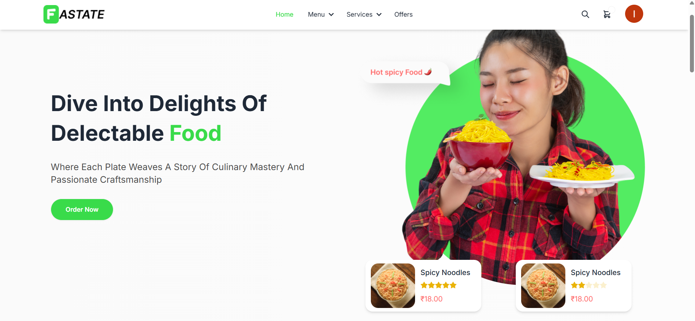
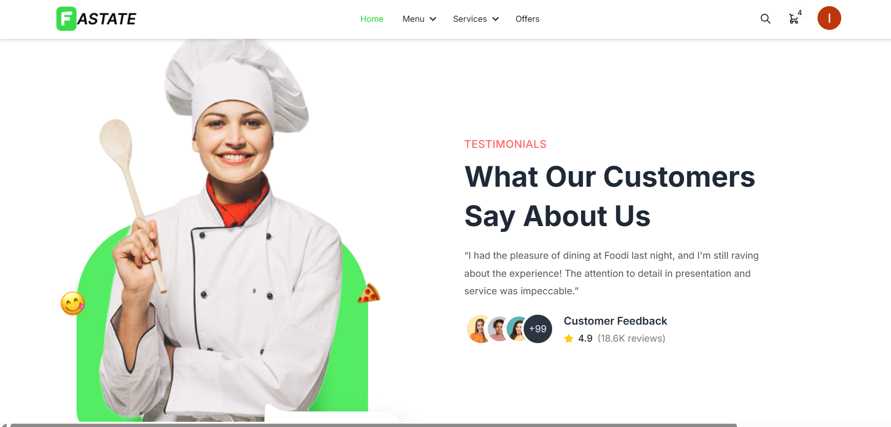
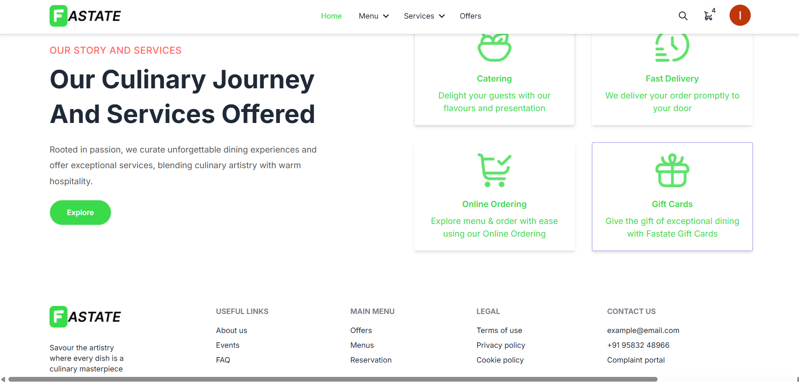
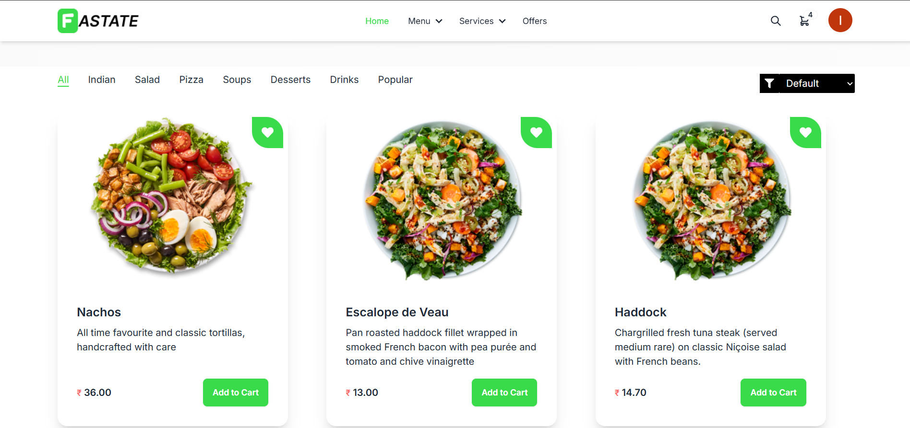
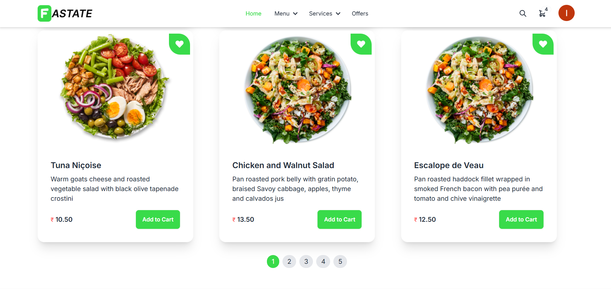
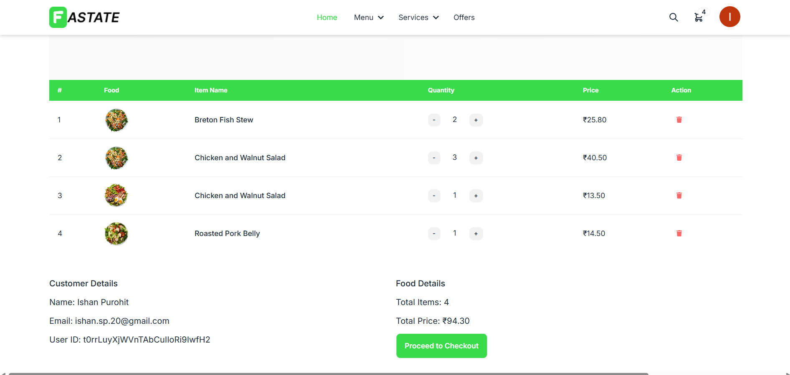
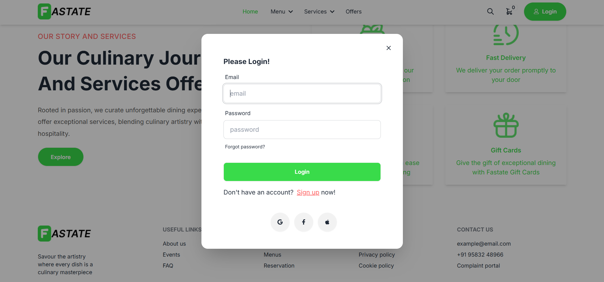
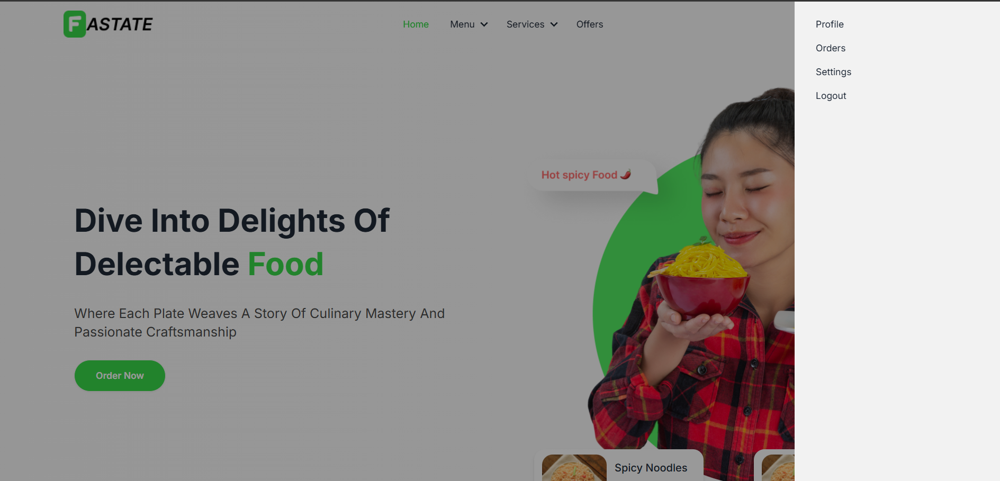

# Fastate

# 🍽️ Fastate - Cloud Kitchen Platform

Fastate is a full-stack MERN (MongoDB, Express.js, React.js, Node.js) web application that empowers cloud kitchens to manage their online presence and streamline customer orders efficiently. It offers a seamless experience for users to browse menus, place orders, and track deliveries in real-time.

---

## 🚀 Features

- 🔍 Browse food items by category and popularity
- 🛒 Add to cart, place orders, and track real-time order status
- 🧾 Dynamic order summary and billing
- 📱 Fully responsive and mobile-friendly UI
- 👩‍🍳 Admin dashboard to manage food items, view orders, and update statuses
- 🔐 Secure user authentication (JWT-based login/registration)
- 🌐 RESTful APIs for all backend operations

---

## 🛠️ Tech Stack

| Technology | Description |
|------------|-------------|
| **MongoDB** | NoSQL database for storing user data, orders, and menus |
| **Express.js** | Backend framework to handle APIs |
| **React.js** | Frontend framework for building interactive UI |
| **Node.js** | JavaScript runtime environment for the server |
| **JWT** | Secure user authentication |
| **Bootstrap / Tailwind** | UI styling for responsive design |

---

## 🖼️ Screenshots

### 🏠 Dashboard

### 📋 Menu Page

### 🛒 Cart Page

### 📦 Login page

### ⚙️ Profile Page

---

## 🔮 Future Enhancements

- 💳 Payment Gateway Integration
- 📲 OTP-Based Authentication & Delivery Partner App
- 📦 Inventory & Kitchen Management System
- 🤖 AI-Powered Food Recommendations
